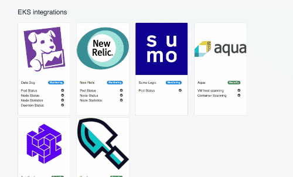

# EKS Feature Matrix :tada: :fireworks:

EKS Feature Matrix Frontend using **React** + **Redux** + **GraphQL** + **Bootstrap** + **SASS**

EKS Feature Matrix Backend **Golang** + **GraphQL** + **MongoDB**

It's built on top of [`create-react-app`](http://www.google.lt)

Usage
-
Documentation how to *run*, *build* and *test* app

> yarn start

License
-
The MIT License (MIT). Please see License File for more information.

TODO
- Features/Categories tabs
- Adding Buttons to Searching
- Re-Adjust Size to be not to obstrusive
